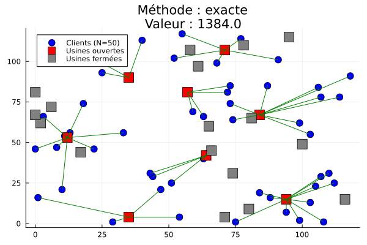
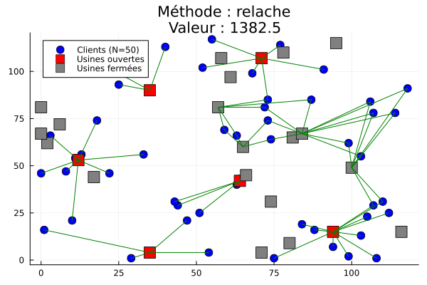
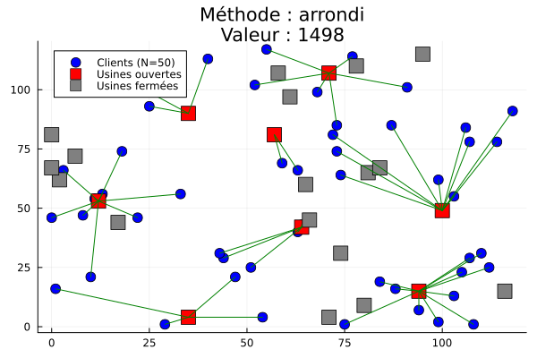

# Problème de localisation simple

Scripts pour cours MLA du MPRO 2025-26

`generer_instance.jl` : génère des instances de localisation simple avec :
    * **L** : taille d'un côté de la grille
    * **N** : nombre de clients
    * **M** : nombre d'usines/sites
    ==> génère les matrices de distances entre chaque couple client-usine

Deux types d'instances : carrés de côté **L** ("CAR"), hexagones réguliers de côté **L** avec grille triangulaire ("HEX").

+ scripts pour visualiser les instances sur un diagramme 2D.

## Méthodes

`localisation_simple.jl` : Résolution exacte par PLNE du problème de localisation simple.

`heuristique_arrondi.jl` : Résolution de la relaxation continue du problème de localisation simple + implémentation de la méthode d'approximation par arrondi (4-approximation)

`primal_dual.jl` : Implémentation de la méthode primale-dual de Jain et Vazirani (2001). 3-approximation.

## Résultats

`run.jl`: Génère une série d'instances et applique les méthodes suscitées.

| Numéro | Type | L | N | M | Obj(exact) | Obj(relâché) | Obj(arrondi) | Obj(primal-dual) |
| :----: | :--- | -: | -: | -: | -: | -: | -: | -: |
| inst_1 | "CAR" | 20 | 20 | 10 | 200.0 | 200.0 | 200 | 244 |
| inst_2 | "CAR" | 40 | 20 | 10 | 299.0 | 299.0 | 299 | 300 |     
| inst_3 | "CAR" | 60 | 20 | 10 | 457.0 | 457.0 | 457 | 519 |     
| inst_4 | "CAR" | 80 | 20 | 10 | 572.0 | 572.0 | 572 | 617 |     
| inst_5 | "CAR" | 100 | 20 | 10 | 706.0 | 706.0 | 706 | 716 |    
| inst_6 | "CAR" | 120 | 20 | 10 | 724.0 | 724.0 | 724 | 749 |    
| inst_7 | "CAR" | 140 | 20 | 10 | 798.0 | 798.0 | 798 | 872 |    
| inst_8 | "CAR" | 160 | 20 | 10 | 1069.0 | 1069.0 | 1069 | 1168 |
| inst_9 | "CAR" | 180 | 20 | 10 | 1164.0 | 1164.0 | 1164 | 1216 |
| inst_10 | "CAR" | 200 | 20 | 10 | 1184.0 | 1184.0 | 1184 | 1205 |
| inst_11 | "HEX" | 10 | 20 | 10 | 146.0 | 146.0 | 146 | 157 |    
| inst_12 | "HEX" | 20 | 20 | 10 | 293.0 | 293.0 | 293 | 467 |    
| inst_13 | "HEX" | 30 | 20 | 10 | 389.0 | 389.0 | 389 | 389 |    
| inst_14 | "HEX" | 40 | 20 | 10 | 398.0 | 398.0 | 398 | 427 |    
| inst_15 | "HEX" | 50 | 20 | 10 | 480.0 | 480.0 | 480 | 487 |    
| inst_16 | "HEX" | 60 | 20 | 10 | 541.0 | 541.0 | 541 | 603 |    
| inst_17 | "HEX" | 70 | 20 | 10 | 591.0 | 591.0 | 591 | 595 |    
| inst_18 | "HEX" | 80 | 20 | 10 | 697.0 | 697.0 | 697 | 712 |    
| inst_19 | "HEX" | 90 | 20 | 10 | 712.0 | 712.0 | 712 | 732 |    
| inst_20 | "HEX" | 100 | 20 | 10 | 878.0 | 878.0 | 878 | 973 |   
| inst_21 | "CAR" | 60 | 50 | 25 | 741.0 | 741.0 | 741 | 995 |    
| inst_22 | "CAR" | 70 | 50 | 25 | 917.0 | 917.0 | 917 | 966 |    
| inst_23 | "CAR" | 80 | 50 | 25 | 987.0 | 987.0 | 987 | 1020 |   
| inst_24 | "CAR" | 90 | 50 | 25 | 989.0 | 989.0 | 989 | 1063 |   
| inst_25 | "CAR" | 100 | 50 | 25 | 1111.0 | 1111.0 | 1111 | 1225 |
| inst_26 | "CAR" | 110 | 50 | 25 | 1162.0 | 1160.0 | 1184 | 1208 |
| inst_27 | "CAR" | 120 | 50 | 25 | 1384.0 | 1382.5 | 1498 | 1591 |
| inst_28 | "CAR" | 130 | 50 | 25 | 1310.0 | 1310.0 | 1310 | 1355 |
| inst_29 | "CAR" | 140 | 50 | 25 | 1441.0 | 1441.0 | 1441 | 1606 |
| inst_30 | "CAR" | 150 | 50 | 25 | 1501.0 | 1501.0 | 1501 | 1571 |
| inst_31 | "HEX" | 20 | 50 | 25 | 506.0 | 506.0 | 506 | 596 |    
| inst_32 | "HEX" | 40 | 50 | 25 | 803.0 | 803.0 | 803 | 893 |    
| inst_33 | "HEX" | 60 | 50 | 25 | 983.0 | 983.0 | 983 | 1113 |   
| inst_34 | "HEX" | 80 | 50 | 25 | 1286.0 | 1286.0 | 1286 | 1346 |
| inst_35 | "HEX" | 100 | 50 | 25 | 1394.0 | 1394.0 | 1394 | 1635 |
| inst_36 | "HEX" | 120 | 50 | 25 | 1716.0 | 1716.0 | 1716 | 1945 |
| inst_37 | "HEX" | 140 | 50 | 25 | 1740.0 | 1740.0 | 1740 | 1817 |
| inst_38 | "HEX" | 160 | 50 | 25 | 2089.0 | 2089.0 | 2089 | 2295 |
| inst_39 | "HEX" | 180 | 50 | 25 | 2317.0 | 2317.0 | 2317 | 2625 |
| inst_40 | "HEX" | 200 | 50 | 25 | 2408.0 | 2408.0 | 2408 | 2534 |

# Exemple d'une (rare) instance où la solution relâchée est différente de l'optimal :

cf. `instances/inst_27`

